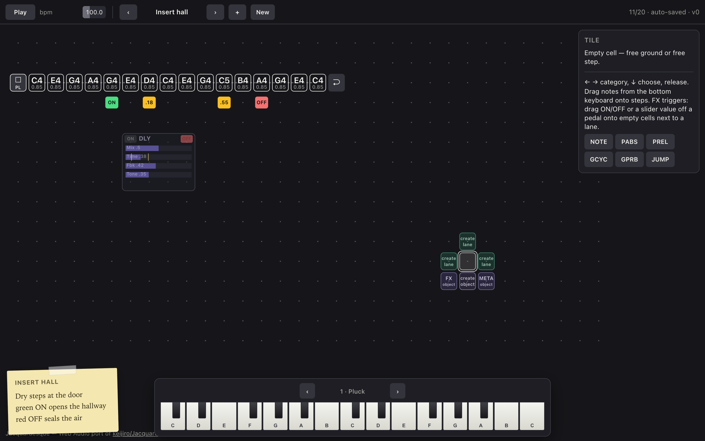
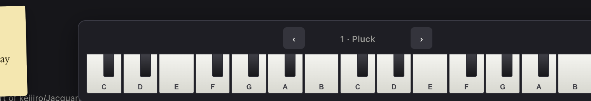

# Jacquardesque

**Jacquardesque** is a public fork and full **Web Audio** port of
[**keijiro/Jacquard**](https://github.com/keijiro/Jacquard) by
[Keijiro Takahashi](https://github.com/keijiro).

Jacquard remains the upstream Unity prototype. Jacquardesque keeps that
provenance visible: this is a fork and a browser port of that work, not an
independent reimplementation without credit.

| | |
| --- | --- |
| Upstream | [github.com/keijiro/Jacquard](https://github.com/keijiro/Jacquard) |
| This fork | [github.com/williamsharkey/jacardesque](https://github.com/williamsharkey/jacardesque) |
| **Play in the browser** | **[williamsharkey.github.io/jacardesque](https://williamsharkey.github.io/jacardesque/)** |
| Full manual | [docs/MANUAL.md](docs/MANUAL.md) |

---

## Play the demo

**[https://williamsharkey.github.io/jacardesque/](https://williamsharkey.github.io/jacardesque/)**

Click **Play** (or press **Space**). Browsers require a gesture before audio starts.


---

## What you can do

### Grid sequencer
- Freeform **lanes** of steps anywhere on a plane (draw a path from empty ground)
- **Stacks** (gates above notes), **parameter locks**, **jumps** / side lanes
- **Circular tape-loops** and reshapeable start/end handles (inactive portion at half opacity while dragging)
- **Toroidal** wrap (edges connect)

### Instruments
- Multi-timbre worklet: FM, kick, snare, hat, bass, pad, bell, pluck
- Channel head names + step division
- Bottom **keyboard dock**: audition, cycle lanes, **drag keys onto steps**

### Insert FX + adjacency triggers
No path-send cables. Pedals are **master-bus inserts**.


| Chip / pad | Meaning |
| --- | --- |
| Green **ON** / red **OFF** | Drag beside a step → engage or bypass when the playhead lights a neighbor |
| Gold chip | FX parameter value (drag off a pedal slider) |
| Cyan chip | **Instrument** parameter (drag off a Sound-panel bar) |
| Opacity | Chip **1.0** next to a lane, **0.5** otherwise; pedal **1.0** when ON, **0.5** when off |

Bypass uses a short sample ramp so inserts do not click.

### Empty-cell shell (morphic menu)



Click empty ground:

| Direction | Result |
| --- | --- |
| Left / up / right | **Create lane** — path follows the drag (mode locks once started) |
| Down one row | **Create object** — FX pedals (delay, reverb, …) |

### Multi-pattern clock
- Sketch bank with auto-save (`‹ ›` switch, `+` duplicate, **New**)
- **Pattern ± chips**: drag transport `‹` / `›` onto the grid (beside a step). Click still steps the bank. Adjacency fire changes pattern without rewinding the global beat.

---

## Using it (cheat sheet)

| Action | How |
| --- | --- |
| Play / stop | **Space** or Play button |
| Move cursor | Click cell, or arrow keys |
| Write a note | Drag from **dock keyboard**, double-click free step, or place-menu **NOTE** |
| Transpose note | Shift+↑↓ (⌘/Ctrl+Shift for octave) |
| Gate / lock / jump | Place menu on a free step (**GATE** / **LOCK** / **FLOW**) |
| Move tile / lane | Drag tile or **CHAN** head |
| Reshape loop | Drag 𝄋 start or end handle |
| New freeform lane | Empty cell → drag L/U/R, paint path, release |
| Place FX pedal | Empty cell → drag **down** → pick DELAY/REVERB/… |
| Automate FX param | Scrub pedal slider → drag value off onto a cell **beside** a step |
| Automate instrument | Select **CHAN** → Sound panel → drag bar off onto grid |
| Engage insert mid-phrase | Drag green **ON** beside start step; **OFF** beside end step |
| Pattern ± on grid | Drag transport **‹** / **›** onto empty ground beside a step |
| Remove | Delete key / panel Delete |
| Cancel | **Esc** |



Full walkthrough: **[docs/MANUAL.md](docs/MANUAL.md)**.

---

## Factory sketches

### Showcase (features & triggers)

| Sketch | Shows |
| --- | --- |
| **Insert hall** | Delay ON/OFF window + time chips |
| **Stereo street** | Pan insert + L/R pan chips |
| **Voice dial** | Cyan channel Level & Mod index chips |
| **Gate room** | Cycle/prob gates + reverb only on open hits |
| **Pedal stack** | Distort + delay + reverb staggered ON |
| **Metric tape** | Multi-lane groove + delay time on beats |
| **Filter wound** | Filter cutoff chips + distort burst |
| **Branch river** | JUMP/JDST, locks, delay on branch |
| **Pattern carousel** | Adjacency P+/P− chips + reverb |
| **Tape loop garden** | Freeform path, dual delays, channel level chips |

### Haiku set
Ten additional musical pieces (Rain on tin, …) with sticky haiku notes.

---

## Sound engine

Sample-accurate scheduling on an `AudioWorklet` (no cloud, works offline on GitHub Pages).

| Option | Notes |
| --- | --- |
| **Shipped worklet** | Multi-timbre + insert FX graph + ramps |
| SpessaSynth / smplr | Possible future SF2 path |

---

## Local development

```bash
npm install          # once — puppeteer-core for browser smoke
npm run serve        # http://localhost:8080/
npm test             # core model / format / sequencer
npm run test:browser # headless Chrome smoke
```

### Architecture

| Path | Role |
| --- | --- |
| `docs/js/core.js` | Model, format, sequencer |
| `docs/js/fx-model.js` | Inserts, adjacency triggers |
| `docs/js/processor.js` | AudioWorklet DSP + insert chain |
| `docs/js/editor.js` | Editing operations |
| `docs/js/ui.js` | Score plane, shell, panels, dock |
| `docs/js/examples.js` | Haiku factory sketches |
| `docs/js/examples-fx.js` | Showcase factory sketches |
| `docs/index.html` | GitHub Pages entry |

GitHub Pages serves the `docs/` folder from `main`.

---

## Documentation

| Doc | Content |
| --- | --- |
| [docs/MANUAL.md](docs/MANUAL.md) | Feature manual with screenshots |
| [docs/sequencer.md](docs/sequencer.md) | Sequencer specification (upstream-oriented) |
| [docs/prototype.md](docs/prototype.md) | Prototype intent |
| [docs/implementation.md](docs/implementation.md) | Unity build notes |
| [docs/mockup.html](docs/mockup.html) | Static look mockup |

---

## Credit

Jacquardesque ports and extends [keijiro/Jacquard](https://github.com/keijiro/Jacquard) by **Keijiro Takahashi**. All credit for the original plane-sequencer concept and design belongs upstream.

License: follow the repository license and upstream Jacquard terms.
