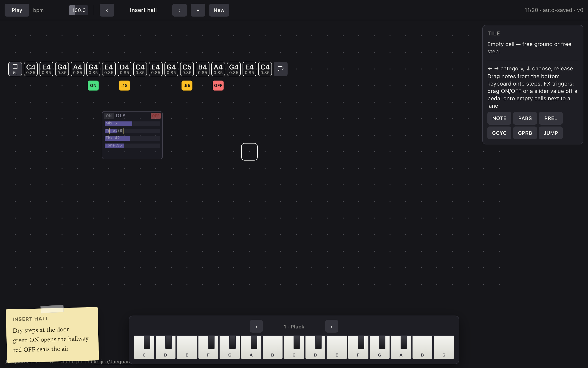

# Jacquardesque user manual

Browser grid sequencer — lanes on a plane, inserts on the bus, adjacency triggers.

**Live demo:** [williamsharkey.github.io/jacardesque](https://williamsharkey.github.io/jacardesque/)

---

## Quick start

1. Open the demo (or serve `docs/` locally).
2. Click **Play** or press **Space** (browsers need a gesture for audio).
3. Use **‹ ›** in the transport to step through factory sketches.
4. Edit freely — sketches **auto-save** in `localStorage`.

| Control | Action |
| --- | --- |
| Space | Play / stop |
| Arrow keys | Move cursor |
| Delete | Remove tile / FX / trigger under cursor |
| Esc | Cancel drag, menu, reshape |
| Shift+↑↓ | Transpose selected note (add ⌘/Ctrl for octave) |

---

## The plane


- **Lanes** run as paths of steps (horizontal by default; freeform when drawn).
- **CHAN** is the channel head (instrument, division, name).
- **Term** is the loop end; **dal segno 𝄋** is the start.
- Drag start or end handles to reshape — inactive portion stays visible at **0.5 opacity** while you drag; release commits.
- Stack tiles top-down (gate above note). The runner reads the stack top-first.

### Empty ground shell (morphic menu)

Click an **empty cell** (not on a lane). A grid-native shell appears:

| Zone | Gesture |
| --- | --- |
| **Left / above / right** of the cell | Drag that way → **draw a new lane** (path follows the pointer; stays in lane mode even if you later go down) |
| **One row below** the cell | Drag down → **create object** menu (**INST** instruments + **FX** pedals) |

Release on an item to place it. Click without leaving the cell to dismiss.

### Lane cells

Click-drag a free step on a lane for the **tile place menu**: NOTE / GATE / LOCK / FLOW.  
Prefer notes from the **bottom keyboard** (drag a key onto a step).

---

## Transport & sketches

| Control | Meaning |
| --- | --- |
| Play / Stop | Transport |
| bpm bar | Tempo (drag) |
| ‹ title › | Click: previous / next sketch. **Drag** ‹ / › onto the grid → place Pattern − / Pattern + adjacency chips |
| + | Duplicate current sketch |
| New | Blank sketch |

Factory bank includes **10 haiku pieces** and **10 showcase compositions** (inserts, triggers, branches, pattern chips).

---

## Sound (instruments)

Select a **CHAN** head → **Sound** panel.

- Choose **Instrument** (FM, kick, snare, hat, bass, pad, bell, pluck).
- Scrub parameter bars (level, pan, mod index, …).
- **Drag vertically off a bar** onto free ground **next to a lane step** → cyan **instrument param trigger**.
- Yellow/cyan **ticks** on the bar mark values you have dragged out.

When the playhead lights a step **adjacent** to that chip, the channel param latches to the chip value.

---

## Grid instruments

Instrument pedals sit on free ground (place menu **INST**: Kick, Snare, Hat, …).

- **Many lanes → one instrument**: each channel lane’s **end/repeat** marker (term) binds to the **nearest** instrument measured by Manhattan distance to that instrument’s **left-corner** cell.
- **Underlight path**: the grid highlights the NESW **staircase of cells** from the term to that corner (not a single canvas line) so you can see the walk.
- Pedals work like FX: grip to move, scrub param bars, drag a value off onto the grid as a cyan **channel** trigger.
- If no instrument objects exist, lanes fall back to the classic channel number on the CHAN head.

## Grid FX (inserts)

FX pedals sit on free ground. They are **master-bus inserts** (not path sends).



| Control | Action |
| --- | --- |
| **ON** pad (top-left) | Drag onto free cell **beside** a step → engage insert when that step’s neighbor lights |
| **OFF** pad (top-right) | Same → bypass (mix ramps to 0, ~10 samples, no click) |
| Param **slider** | Scrub on the pedal; drag a value off the slider → gold **FX param trigger** |
| Pedal opacity | **1.0** when ON, **0.5** when off |
| Trigger opacity | **1.0** when next to any lane cell, **0.5** otherwise |
| Trigger labels | Two-line face: **action** (ON / OFF / value / P+) + **owner** (DLY / HH / PAT, …) |
| Cancel drop | Drop back **on the pedal** |

### Adjacency rule

A trigger fires when it is **orthogonally adjacent** (not diagonal) to a **playhead-lit** step cell. Values **sample-and-hold** until another chip for the same target fires, or transport stops.

### Pattern ± chips

Drag transport **‹** (Pattern −) or **›** (Pattern +) onto empty ground beside a step. When an adjacent step lights, the sketch bank steps without rewinding the global beat clock. Click ‹ › without dragging still changes the sketch immediately.

---

## Bottom keyboard dock

Always on screen:

- **Click** a key → audition the **focus lane** instrument.
- **‹ ›** beside the lane name → cycle channel lanes.
- **Drag** a key onto a free lane step → place a note (ghost full opacity when valid, 0.5 when not).

---

## Editing cheatsheet

| Goal | How |
| --- | --- |
| New freeform lane | Empty cell → drag L/U/R, paint a path, release |
| Place delay / reverb | Empty cell → drag **down** → FX → release on type |
| Note on a step | Dock keyboard drag, double-click, or place menu NOTE |
| Gate | Place menu GATE (cycle / probability) |
| Parameter lock | Place menu LOCK (PABS / PREL) |
| Branch | JUMP tile; JDST lane appears |
| Automate delay time | Select delay → scrub Time → drag value off slider to a cell beside a step |
| Automate voice level | CHAN → Sound → drag Level bar off onto grid |
| Engage reverb mid-phrase | Drag green **ON** beside the step where reverb should start; **OFF** where it should stop |
| Pattern + / − on grid | Drag transport **›** / **‹** onto a cell beside a step |
| Reshape loop | Drag 𝄋 start or TERM end; inactive steps stay half-visible mid-drag |

---

## Showcase sketches (factory)

| Sketch | Demonstrates |
| --- | --- |
| **Insert hall** | Delay ON/OFF window + time chips |
| **Stereo street** | Pan insert + alternating pan chips |
| **Voice dial** | Channel level & mod-index cyan chips |
| **Gate room** | Cycle/prob gates + reverb ON only on gated hits |
| **Pedal stack** | Distort → delay → reverb staggered ON |
| **Metric tape** | Multi-lane groove + delay time on beats |
| **Filter wound** | Filter cutoff chips + distort burst |
| **Branch river** | JUMP/JDST, locks, delay on branch |
| **Pattern carousel** | Adjacency P+/P− chips + reverb |
| **Tape loop garden** | Freeform path, dual delays, channel level chips |
| **Air Dagger · A–D** | Polyrhythmic dance suite: lengths 5/7/15/16/21, chords, GPRB, locks, FX/instrument chips, form-lane **patgo** A→B→C→D→A |

Plus ten musical **haiku** sketches (Rain on tin, …) in the same bank.

### Offline sim / event log

```bash
npm run test:air -- --seed 1 --seconds 40
```

Uses the same `Sequencer.schedule` + adjacency triggers as the browser, with a seeded PRNG for probability gates. No Web Audio — emits JSONL lines (`step`, `sample`, `type=note|trig|pattern`, …) for fast regression checks.

---

## Local development

```bash
npm run serve
# open http://localhost:8080/

npm test
npm run test:browser
```

GitHub Pages serves the `docs/` folder from `main`.

---

## Credit

Jacquardesque is a public Web Audio port of [keijiro/Jacquard](https://github.com/keijiro/Jacquard) by Keijiro Takahashi.
